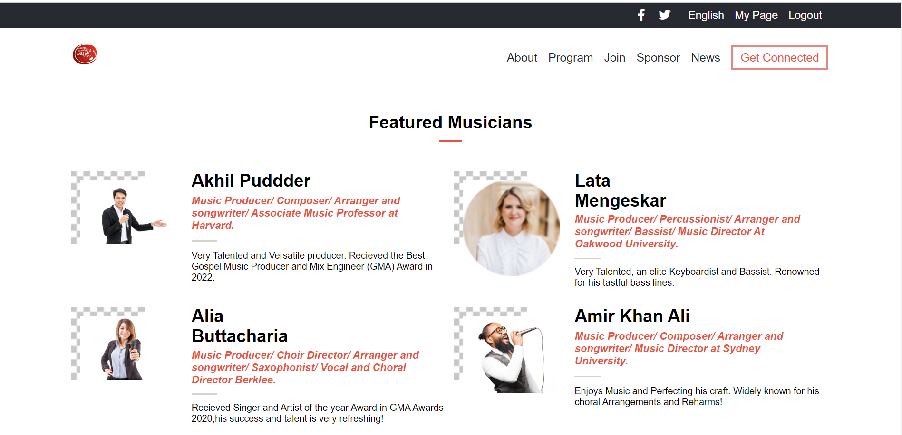

<a name="readme-top"></a>

<div align="center">
 <h3><b>FirstCapstone
</b>.
 </h3>
</div>

<div align="center">
<h3><b>Screenshot</b></h3>


</div>

<!-- TABLE OF CONTENTS -->

# 📗 Table of Contents

- [📖 About the Project](#about-project)
  - [🛠 Built With](#built-with)
    - [Tech Stack](#tech-stack)
    - [Key Features](#key-features)
  - [🚀 Live Demo and presentation video](#live-demo)
- [💻 Getting Started](#getting-started)
  - [Setup](#setup)
  - [Prerequisites](#prerequisites)
  - [Install](#install)
  - [Usage](#usage)
  - [Run tests](#run-tests)
  - [Deployment](#triangular_flag_on_post-deployment)
- [👥 Authors](#authors)
- [🔭 Future Features](#future-features)
- [🤝 Contributing](#contributing)
- [⭐️ Show your support](#support)
- [🙏 Acknowledgements](#acknowledgements)
- [📝 License](#license)

<!-- PROJECT DESCRIPTION -->

## 📖 First Capstone <a name="about-project"></a>

**FirstCapstone** is a personal learning project aimed at mastering the best practices for utilizing HTML, CSS, and JavaScript.

<h5>
<b>Arcadia MusicFest-2023<b> For over three decades, Arcadia Academy of Music has been hosting Musicfest, our biggest event that allows our students to showcase their musical talents in front of their peers, friends, and family. Due to the pandemic, last year's competition was held online, but this year, we are thrilled to announce that Musicfest is back as an in-person event! Musicfest is a testament to the exceptional teaching, support, and encouragement our students receive at Arcadia Academy of Music. This competition brings all of our locations together to celebrate and showcase the best and brightest musical talents from our community.</h5>

## 🛠 Built With <a name="built-with"></a>

## Tech Stack <a name="tech-stack"></a>

<details>
  <summary>Client</summary>
  <b>This project only works client side right now.</b>
  <ul>
    <li>HTML</li>
    <li>CSS</li>
    <li>JS</li>
  </ul>
</details>
<details>
  <summary>Server</summary>
  <ul>
    <li><a href=#>Server - It is Hosted on GitHub</a></li>
  </ul>
</details>

<details>
<summary>Database</summary>
  <ul>
    <li>Currently it doesn't use database</li>
  </ul>
</details>

<!-- Features -->

## Key Features <a name="key-features"></a>

- **css animation**
- **Upcoming Music fest time calculation**
- **Showcase music fest details**

<p align="right">(<a href="#readme-top">back to top</a>)</p>

<!-- LIVE DEMO -->

## 🚀 Live Demo and presentation video <a name="live-demo"></a>

- [Presentation video Link](https://www.loom.com/share/7d528a4ee1db40e7bb14eda9dcae25f2)
- [Live Demo Link](https://abdussattar-70.github.io/FirstCapstone/)

<p align="right">(<a href="#readme-top">back to top</a>)</p>

<!-- GETTING STARTED -->

## 💻 Getting Started <a name="getting-started"></a>

To get a local copy up and running, follow these steps.

## Prerequisites <a name="prerequisites"></a>

- In order to run this project you need:

### It would be best if you had some familiarity with `HTML`, `CSS`,`JS`.

- A Computer (MAC or PC)
- code editor (VSCode,Atom etc...)
- A browser (Chrome,Mozilla,Safari etc...)
- Version Control System (Git and Github)

# Setup <a name="setup"></a>

Clone this repository to your desired folder:

```bash
       git clone https://github.com/AbdusSattar-70/FirstCapstone.git
       cd FirstCapstone
```

# Install <a name="install"></a>

Install this project with:

```bash
     npm install
```

# Run tests and check errors <a name="run-tests"></a>

To run tests and check errors, run the following command:

- To check Styelint error:-

```bash
   npm test
```

```bash
   npx stylelint "\*_/_.{css,scss}"
```

- To check Eslint error:-

```bash
  npx eslint .
```

# Deployment <a name="triangular_flag_on_post-deployment"></a>

You can deploy this project using:

- Render Hosting server or GitHub pages

```bash
   npm install
   npm run start
```

<p align="right">(<a href="#readme-top">back to top</a>)</p>

<!-- AUTHORS -->

## 👥 Authors <a name="authors"></a>

## 👤 Abdus Sattar

- GitHub: [AbdusSattar-70](https://github.com/AbdusSattar-70)
- Twitter: [Abdus Sattar](https://twitter.com/Abdus_Sattar70)
- LinkedIn: [Abdus Sattar](https://www.linkedin.com/in/abdus-sattar-a41a26215/)

<p align="right">(<a href="#readme-top">back to top</a>)</p>

<!-- FUTURE FEATURES -->

## 🔭 Future Features <a name="future-features"></a>

- **Web Responsiveness for all users**
- **Add web accessibility**
- **Add Login page**

<p align="right">(<a href="#readme-top">back to top</a>)</p>

<!-- CONTRIBUTING -->

## 🤝 Contributing <a name="contributing"></a>

Everybody is welcome to suggest, changes,Contributions, issues, and feature request in this project.

In order to do it, fork this repository, create a new branch and open a Pull Request from your branch.

Feel free to check the [issues page](../../issues/).

<p align="right">(<a href="#readme-top">back to top</a>)</p>

<!-- SUPPORT -->

## ⭐️ Show your support <a name="support"></a>

If you like this project, Please give me ⭐️ and you can use it following [MIT](./LICENSE) license.

<p align="right">(<a href="#readme-top">back to top</a>)</p>

<!-- ACKNOWLEDGEMENTS -->

## 🙏 Acknowledgments <a name="acknowledgements"></a>

I would like to thank microverse for the opportunity to learn how to set up this project.
The Original design idea is by <a href="https://www.behance.net/adagio07"><b>Cindy Shin in Behance</b> <a> Thanks ❤️ to <b>Cindy Shin</b> Creating such a beautiful design.

<p align="right">(<a href="#readme-top">back to top</a>)</p>

<!-- LICENSE -->

## 📝 License <a name="license"></a>

This project is under [MIT](./LICENSE) licensed.

<p align="right">(<a href="#readme-top">back to top</a>)</p>
